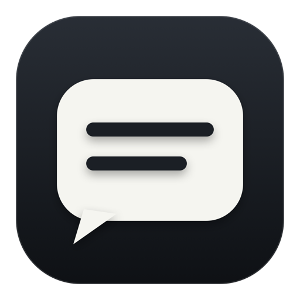

<p align="center">
  
</p>

<h1 align="center">Said</h1>

<p align="center"><strong>Live captions for anything your Mac plays.</strong></p>

<p align="center">
  Said turns Mac audio into calm, readable English captions entirely on-device.<br>
  No bot. No account. No transcript history.
</p>

<p align="center">
  <a href="https://github.com/r3dbars/said/actions/workflows/quality.yml"></a>
  
  
  
  <a href="LICENSE"></a>
</p>

<p align="center"><em>Hear. Read. Gone.</em></p>

---

## The whole product

1. Open Said.
2. Allow **System Audio Recording Only** and download the verified local model once.
3. Play a call, video, podcast, voice message, or webinar.
4. Read the floating two-line caption strip.
5. Quit Said. The captions are gone.

Said lives in the menu bar, stays above full-screen apps, never steals keyboard focus, and hides itself when there is nothing useful to read. Captions grow along the lower row, then advance upward one complete row at a time, so your eyes always have a stable place to return to while tentative words settle softly.

## Why Said

| | Said |
| --- | --- |
| **Audio source** | Sound playing through your Mac |
| **Recognition** | Parakeet Unified EN 0.6B Q8_0 on Metal |
| **Network after setup** | Not required for captioning |
| **Microphone** | Never requested or captured |
| **Screen pixels** | Never captured |
| **Audio recordings** | Never created |
| **Transcript history** | Never created |
| **Account or bot** | None |

This is not a meeting platform or an AI workspace. Said does one job: it lets you read what your Mac is already playing.

## Try the local alpha

Said currently supports Apple-silicon Macs running macOS 26 or later. The local speech model is a one-time download of approximately 731 MB.

```bash
git clone --recurse-submodules https://github.com/r3dbars/said.git
cd said
./scripts/bootstrap.sh
./scripts/build-and-run.sh --verify
```

On first launch, allow Said under:

> System Settings → Privacy & Security → System Audio Recording Only

The app installs its pinned model through the setup window, then starts captioning automatically on later launches. Local development builds are ad-hoc signed unless you explicitly provide a trusted development identity; macOS may therefore ask for permission again after rebuilding.

> [!IMPORTANT]
> Said is a playable alpha, not yet a notarized public release. Do not redistribute the local alpha as a finished release.

## Privacy is the architecture

```text
Mac playback
    ↓
Private Core Audio process tap
    ↓
48 kHz stereo → 16 kHz mono Float32, in memory
    ↓
Parakeet Unified streaming inference on Metal
    ↓
Stable prefix + tentative suffix
    ↓
Two-line caption panel
    ↓
Released when the stream ends or Said quits
```

Said may persist only the verified speech model, its content-free installation receipt, and ordinary app preferences. It does not write PCM, audio files, captions, or transcripts. Operational logs are allowlisted and contain counts, states, durations, and safe error codes—not spoken content.

Read the complete [privacy contract](docs/privacy.md) and [threat model](docs/threat-model.md).

## Native all the way down

Said is a Swift 6 app with no browser shell, Python service, local web server, model daemon, or cloud recognizer.

```text
SaidApp       AppKit lifecycle, menu bar, setup, settings, caption panel
SaidCapture   Core Audio process tap, normalization, bounded PCM pipeline
SaidASR       Parakeet streaming actor and transcribe.cpp adapter
SaidModel     Resumable download, SHA-256 verification, atomic install
SaidCore      Pure caption, state, diagnostics, and buffer behavior
```

The runtime and model are pinned by immutable revisions, exact sizes, and SHA-256 hashes. See [architecture](docs/architecture.md), [model provenance](docs/model-provenance.md), and the original [product requirements](docs/PRD.md).

## Build and verify

The repository keeps model-dependent hardware checks explicit while ordinary CI remains deterministic and does not download the 731 MB model.

```bash
# Deterministic tests and privacy contract
./scripts/run-tests.sh

# Real model streaming
./scripts/streaming-smoke.sh

# Real Mac playback → local model → caption pipeline
./scripts/capture-smoke.sh

# Installed model + live captions with per-process network observation
./scripts/offline-smoke.sh

# Known fixture + quit + log/app-storage retention inspection
./scripts/post-quit-privacy-smoke.sh

# Long-session stability and bounded memory
./scripts/soak-smoke.sh --minutes 30

# Performance and privacy receipts
./scripts/performance-smoke.sh
./scripts/privacy-smoke.sh
```

Current evidence on the development Mac:

- Real system audio reaches the local Parakeet caption pipeline.
- Metal model loading and true streaming are proven.
- 29 deterministic tests and the static privacy gate pass.
- Caption state, PCM queues, capture recovery, model verification, and resumable downloads have regression coverage.
- GitHub Actions builds and verifies an arm64 local app bundle without bundling the speech model.

The [release checklist](docs/release-checklist.md) tracks the remaining physical M1/16 GB, long-session, licensing, Developer ID, notarization, and clean-machine gates.

## Deliberately not in Said

- Microphone capture
- Saved transcripts or recordings
- Pause, rewind, export, or search
- Translation or additional languages
- Speaker labels, summaries, or action items
- Accounts, analytics, subscriptions, or team administration
- Model selection or fallback recognizers
- Cloud inference

Every feature has to improve one loop: **play audio, read captions**.

## Repository guide

| Path | Purpose |
| --- | --- |
| [`Sources/`](Sources/) | Native application and independently testable modules |
| [`Tests/`](Tests/) | Deterministic model, capture, caption, and privacy-adjacent tests |
| [`scripts/`](scripts/) | Bootstrap, build, smoke, soak, privacy, and release tooling |
| [`docs/PRD.md`](docs/PRD.md) | Locked product contract and acceptance bar |
| [`docs/model-spike.md`](docs/model-spike.md) | Streaming benchmark and runtime evidence |
| [`docs/reliability-matrix.md`](docs/reliability-matrix.md) | Proven, partial, and open V1 verification gates |
| [`docs/release-checklist.md`](docs/release-checklist.md) | Local-alpha and public-release gates |

## Contributing

Issues and focused pull requests are welcome. Please keep the product narrow, avoid content-bearing logs and persistence, and include evidence for any change to capture, inference, or caption stability.

Before opening a pull request:

```bash
./scripts/run-tests.sh
./scripts/privacy-smoke.sh
```

Hardware-only behavior must include a hardware receipt; a unit test is not proof of a macOS permission, capture, Metal, latency, or thermal claim.

## License

Said application code is available under the [MIT License](LICENSE). Runtime and model artifacts retain their own licenses and notices; see [third-party licenses](THIRD_PARTY_LICENSES.md) and [model provenance](docs/model-provenance.md).

Public distribution remains blocked until the pinned model/conversion license chain receives explicit human review.
