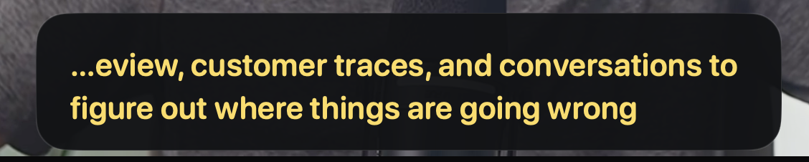
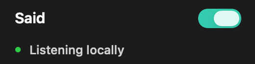
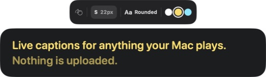
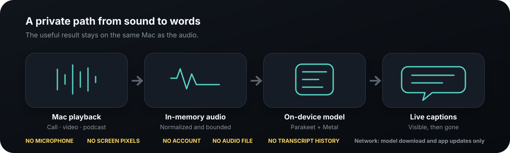

<p align="center">
  
</p>

<h1 align="center">Said</h1>

<p align="center"><strong>Live captions for anything your Mac plays.</strong></p>

<p align="center">
  One private caption layer for calls, videos, podcasts, webinars, and voice messages.<br>
  No meeting bot. No account. No transcript history.
</p>

<p align="center">
  <a href="https://github.com/r3dbars/said/releases/download/v0.1.0-alpha/Said-0.1.0-alpha.dmg"><strong>Download Said 0.1.0 Alpha</strong></a>
  ·
  <a href="#build-from-source"><strong>Build from source</strong></a>
</p>

<p align="center">
  <sub>Apple silicon · macOS 26+ · English · 4.5 MB app + one-time 731 MB model download</sub>
</p>

<p align="center">
  <a href="https://github.com/r3dbars/said/actions/workflows/quality.yml"></a>
  
  
  
  <a href="LICENSE"></a>
</p>

<p align="center"><em>Hear. Read. Gone.</em></p>

<p align="center">
  
</p>

<p align="center"><sub>Real Said captions from a podcast playing in another app.</sub></p>

---

## Sometimes you need subtitles—not a meeting platform

The audio is already playing on your Mac, but the words are still hard to
follow. Maybe the video has no captions. Maybe the call's captions are poor.
Maybe the room is noisy, the volume needs to stay low, or spoken English is
simply easier to understand when you can read it too.

Most workarounds ask you to change the moment: upload a recording, invite a bot,
open a transcript product, or trust another service with the conversation.

Said changes one thing instead: **the Mac gets captions.**

| 1. Turn Said on | 2. Play anything | 3. Read, then turn it off |
| --- | --- | --- |
| One switch in the menu bar. | A call, video, podcast, webinar, training, or voice message. | The caption window stays where you put it. Off clears the ephemeral words and closes the surface. |

No source picker. No meeting to name. No recording to clean up later.

## One switch. One calm reading surface.

<p align="center">
  
</p>

When the switch is on, Said listens only to audio macOS makes available from
other processes and keeps a fixed two-line caption surface visible—even during
silence. When the switch is off, capture stops and the surface disappears.

Captions are designed for reading in motion:

- A fixed left edge gives your eyes a dependable place to return to.
- Complete rows advance together instead of constantly reflowing old words.
- Stable words stay stable; only the newest tentative suffix may soften and change.
- The panel never takes keyboard focus and remains above full-screen apps.
- Hover reveals one compact bar for moving captions, changing the unified
  `XS`–`XL` scale, choosing Rounded/Sans/Serif/Mono/Block, and selecting white,
  warm yellow, or cyan text.

<p align="center">
  
</p>

## Local is not a setting. It is the product.

Said needs continuous access to private audio to be useful. That is exactly the
kind of job that should not require a server.

<p align="center">
  
</p>

After one verified model download, speech recognition runs locally with
Parakeet Unified EN 0.6B Q8_0 on Metal.

| Said can observe | Said deliberately does not collect |
| --- | --- |
| Audio playing through the supported Mac system-audio path while Said is on | Microphone input |
| Temporary PCM and caption text in process memory | Screen pixels, camera, keyboard, clipboard, files, browser history, or window titles |
| Caption appearance and placement preferences | Audio recordings or transcript history |
| Model/update network requests | Accounts, analytics, cloud inference, or remote caption logs |

Said persists the verified speech model, its content-free installation receipt,
and ordinary preferences. It does not claim cryptographic memory erasure; audio
and caption buffers are released when the stream ends or the app quits.

Read the complete [privacy contract](docs/privacy.md),
[threat model](docs/threat-model.md), and
[verification matrix](docs/reliability-matrix.md).

## Install the alpha

Said currently requires an Apple-silicon Mac running macOS 26 or later.

1. [Download **Said-0.1.0-alpha.dmg**](https://github.com/r3dbars/said/releases/download/v0.1.0-alpha/Said-0.1.0-alpha.dmg).
2. Open the DMG and drag **Said** into **Applications**.
3. Control-click Said, choose **Open**, then confirm.
4. Allow **System Audio Recording Only** when macOS asks.
5. Let Said download and verify its English speech model once.
6. Play something with spoken English and turn the Said switch on.

> [!IMPORTANT]
> This is a playable, ad-hoc-signed alpha—not yet a notarized public release.
> The Control-click → Open step is required because no Developer ID certificate
> is configured yet. Do not redistribute this alpha as a finished release.

The release page publishes the DMG checksum and build commit:
[Said 0.1.0 Alpha](https://github.com/r3dbars/said/releases/tag/v0.1.0-alpha).

## What Said is—and is not

| Said is | Said is not |
| --- | --- |
| A native caption layer for Mac system audio | A meeting recorder or transcript archive |
| English-only in V1 | Translation or multilingual recognition |
| One opinionated local model | A model picker or cloud fallback router |
| A deliberate on/off mode | An ambient surveillance process |
| A floating reading surface | A dashboard, chat box, or AI workspace |

There is intentionally no microphone capture, rewind, save, export, search,
speaker labeling, summary, action item, calendar integration, subscription,
analytics SDK, or account system.

Every proposed feature has to improve one loop: **play audio, read captions.**

## Native all the way down

Said is a Swift 6 application with no browser shell, Python service, local HTTP
server, model daemon, or cloud recognizer.

```text
Mac process audio
    ↓
Core Audio process tap (Said excludes its own audio)
    ↓
48 kHz stereo → 16 kHz mono Float32, bounded in memory
    ↓
Parakeet Unified EN 0.6B Q8_0 through pinned transcribe.cpp
    ↓
Metal-backed stable-prefix streaming
    ↓
AppKit NSPanel + SwiftUI caption content
```

The code keeps capture, normalization, recognition, model management, caption
state, and UI independently testable:

```text
SaidApp       AppKit lifecycle, menu bar, setup, settings, caption panel
SaidCapture   Core Audio capture, normalization, bounded PCM pipeline
SaidASR       Parakeet streaming actor and transcribe.cpp adapter
SaidModel     Resumable download, SHA-256 verification, atomic install
SaidCore      Pure caption, state, diagnostics, and buffer behavior
```

Dependencies and model artifacts are pinned by immutable revision, exact byte
count, and SHA-256. Start with the [architecture](docs/architecture.md),
[model provenance](docs/model-provenance.md), and
[product requirements](docs/PRD.md).

## Proof, not promises

The repository separates deterministic CI from tests that require a physical
Mac, real system audio, or the 731 MB model.

Current evidence includes:

- Real Mac system audio reaching the local Parakeet caption pipeline.
- Metal model loading and true streaming.
- 45 deterministic tests plus the static privacy gate.
- Regression coverage for caption stability, bounded PCM queues, capture
  recovery, model verification, and resumable downloads.
- GitHub Actions building and verifying an arm64 app without bundling the model.
- Content-free performance, privacy, and release receipts under `Artifacts/Receipts`.

The [release checklist](docs/release-checklist.md) clearly separates what is
proven from what still blocks a finished public release: physical M1/16 GB
performance, long-session receipts, final model-license review, Developer ID
signing, notarization, and a clean-machine install.

<details>
<summary><strong>Verification commands</strong></summary>

```bash
# Deterministic tests and static privacy contract
./scripts/run-tests.sh

# Real model streaming
./scripts/streaming-smoke.sh

# Real Mac playback → local model → captions
./scripts/capture-smoke.sh

# Installed model + per-process network observation
./scripts/offline-smoke.sh

# Known marker + quit + retained-content inspection
./scripts/post-quit-privacy-smoke.sh

# Long-session stability and bounded memory
./scripts/soak-smoke.sh --minutes 30

# Performance and privacy receipts
./scripts/performance-smoke.sh
./scripts/privacy-smoke.sh
```

</details>

## Build from source

You need Xcode with the macOS 26 SDK on an Apple-silicon Mac.

```bash
git clone --recurse-submodules https://github.com/r3dbars/said.git
cd said
./scripts/bootstrap.sh
./scripts/build-and-run.sh --verify
```

After the first build, reopen the same bundle without replacing its local
code-signing identity:

```bash
./scripts/build-and-run.sh --launch-only
```

Local development builds are ad-hoc signed unless you provide a trusted signing
identity. Rebuilding an ad-hoc bundle can make macOS ask for System Audio
permission again.

## Contributing

Focused issues and pull requests are welcome. Please read
[CONTRIBUTING.md](CONTRIBUTING.md) before changing capture, inference, privacy,
or product scope.

Before opening a pull request:

```bash
./scripts/run-tests.sh
./scripts/privacy-smoke.sh
```

Hardware-only behavior needs a hardware receipt. A unit test is not proof of a
macOS permission, Core Audio capture, Metal latency, power, or thermal claim.

## Repository guide

| Path | Purpose |
| --- | --- |
| [`Sources/`](Sources/) | Native application and independently testable modules |
| [`Tests/`](Tests/) | Deterministic caption, capture, model, and privacy-adjacent tests |
| [`scripts/`](scripts/) | Bootstrap, build, smoke, soak, privacy, and release tooling |
| [`docs/PRD.md`](docs/PRD.md) | Locked product contract and acceptance bar |
| [`docs/model-spike.md`](docs/model-spike.md) | Streaming benchmark and runtime evidence |
| [`docs/reliability-matrix.md`](docs/reliability-matrix.md) | Proven, partial, and open verification gates |
| [`docs/release-checklist.md`](docs/release-checklist.md) | Alpha and public-release requirements |

## License

Said application code is available under the [MIT License](LICENSE). Runtime
and model artifacts retain their own licenses and notices; see
[third-party licenses](THIRD_PARTY_LICENSES.md) and
[model provenance](docs/model-provenance.md).

Public distribution remains blocked until the pinned model/conversion license
chain receives explicit human review.
